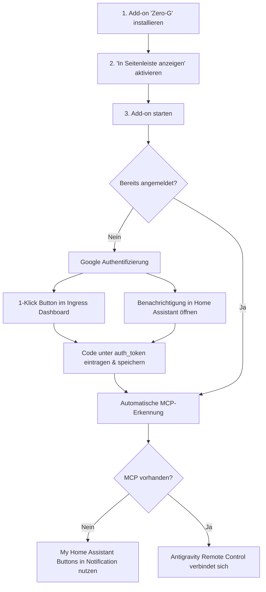

# 🛸 Zero-G: Antigravity AI Assistant für Home Assistant

[🇬🇧 English](README.md) | [🇩🇪 Deutsch](README.de.md)

[](https://my.home-assistant.io/redirect/supervisor_add_addon_repository/?repository_url=https%3A%2F%2Fgithub.com%2Fseppelw%2Fzero-g)


**Zero-G** bringt die autonome Entwicklungs- und Steuerungsplattform **Google Antigravity** direkt in dein Home Assistant. Mit nativer Ingress-Einbindung steht dir das vollständige Dashboard direkt in deiner Seitenleiste zur Verfügung – **ohne externe Portfreigaben**.

Zusätzlich konfiguriert Zero-G automatisch das **Model Context Protocol (MCP)** vor: Sowohl der offizielle **Home Assistant Core MCP Server** als auch die erweiterte **Community-Integration (`czechbol/hass-mcp`)** werden per Live-Erkennung geprüft und automatisch eingebunden. Die KI kann sofort deine Smart-Home-Geräte schalten, Automationen analysieren und Konfigurationsdateien unter `/config` direkt bearbeiten.

---

## 💻 Systemanforderungen (WICHTIG für Proxmox/VM-Nutzer)

Dieses Add-on lädt das offiziell kompilierte **Antigravity Binary** von Google herunter. Dieses Binary ist hochoptimiert und erfordert zwingend einen Prozessor, der den Befehlssatz **PCLMULQDQ (PCLMUL)** unterstützt. 

- **Bare-Metal (Echte Hardware)**: Jeder moderne Prozessor (ab Intel Westmere / AMD Bulldozer, ca. 2011) unterstützt diesen Befehlssatz.
- **Virtuelle Maschinen (Proxmox, ESXi, UNRAID)**: ⚠️ Wenn Home Assistant in einer virtuellen Maschine läuft, ist der CPU-Typ in den Einstellungen der VM oft standardmäßig auf Kompatibilität ausgelegt (z. B. `kvm64` oder `qemu64`). Diese simulierten CPUs verstecken moderne Befehlssätze! 
  - **Die Lösung**: Stelle in Proxmox (oder deinem Hypervisor) den CPU-Typ der Home Assistant VM von `kvm64`/`qemu64` zwingend auf **`host`** um und fahre die VM einmal komplett herunter (Shutdown) und wieder hoch. Andernfalls verweigert das Add-on mit einem Hardware-Kompatibilitätsfehler den Start.

---

## ✨ Features

- 🚀 **Automatischer Download & Updates**: Lädt beim Start automatisch das neueste offizielle Release von Google herunter (inklusive SHA-512-Prüfung). Unterstützt **`amd64` (x86_64)** und **`aarch64` (Raspberry Pi 4/5, HA Green/Yellow)**.
- 🌐 **Nahtlose Ingress-Integration**: Direkt in die Home Assistant Seitenleiste integriert über einen internen Nginx-Proxy mit WebSocket-Unterstützung und dynamischem Pfad-Rewriting.
- 🔌 **Intelligente MCP Server Dual-Integration**:
  - **1. Core MCP Server (`mcp_server`, `/api/mcp`)**: Direkte Steuerung von Lichtern, Schaltern, Klimaanlagen, Szenen und Skripten über die Assist-Pipeline.
  - **2. Community MCP Server (`czechbol/hass-mcp`, `/api/hass_mcp`)**: Erweiterte Entwickler- und Verwaltungstools für YAMLs, Lovelace-Dashboards, HACS und Backups.
  - **Automatische Erkennung**: Erkennt beim Start selbstständig fehlende MCP-Integrationen und sendet Home Assistant Benachrichtigungen mit **My Home Assistant 1-Klick-Buttons**.
  - **Auto-Dual-Mounting**: Sobald die Community-Integration aktiv ist, wird sie ohne Konfigurationsaufwand automatisch eingebunden.
- 🧙‍♂️ **Geführtes Onboarding & Status-Dashboard**:
  - Mehrsprachiges Dashboard (Deutsch / Englisch) direkt im Ingress-Fenster.
  - 1-Klick-Anmeldung bei Google OAuth, Link-Kopierfeld und Statusampeln für Authentifizierung und MCP-Server.
  - Dynamische Erkennung und Anzeige des konfigurierten Instanznamens (`remote_control_name`).
- 💾 **Dauerhafte Persistenz**: Tokens, Arbeitsbereiche (`/data/workspace`), Konversationen und MCP-Konfigurationen bleiben im persistenten `/data`-Volume dauerhaft erhalten.
- 🛠️ **Direkter Zugriff auf HA-Dateien**: `/config` (Automatisierungen, Scripts, `configuration.yaml`, Dashboards), `/share` und `/addons` sind direkt im Container eingehängt.

---

## 📦 Installation

### Option 1: 1-Klick-Installation (Empfohlen)

Klicke auf den folgenden Button, um das Repository direkt zu deinem Home Assistant hinzuzufügen:

[](https://my.home-assistant.io/redirect/supervisor_add_addon_repository/?repository_url=https%3A%2F%2Fgithub.com%2Fseppelw%2Fzero-g)

### Option 2: Manuell hinzufügen

1. Gehe in Home Assistant zu **Einstellungen** -> **Add-ons** -> **Add-on Store**.
2. Klicke oben rechts auf das Drei-Punkte-Menü (⋮) und wähle **Repositories**.
3. Füge folgende Repository-URL ein:
   ```text
   https://github.com/seppelw/zero-g
   ```
4. Klicke auf **Hinzufügen** und schließe den Dialog.
5. Das Add-on **Zero-G** erscheint nun im Add-on Store. Klicke darauf und wähle **Installieren**.

---

## 🎯 Onboarding & Ersteinrichtung



### Erste Schritte

1. Nach der Installation klicke auf **Start**.
2. Klicke auf **Web UI öffnen** (oder den Seitenleisten-Button), um das Zero-G Dashboard zu öffnen.
3. Im Dashboard findest du im ersten Schritt Anweisungen zur **einmaligen Google-Authentifizierung**.
4. Sobald das Add-on authentifiziert ist, zeigt das Dashboard den Status "Aktiv" an.
5. Um auf die KI-Entwicklungsumgebung zuzugreifen, nutze das offizielle Webinterface unter [https://antigravity.google/](https://antigravity.google/) und verbinde dich über die **Remote Control** Funktion mit deiner Instanz (Standard: `homeassistant-zero-g`).

---

## ⚙️ Konfiguration

Die Einstellungen können direkt im Add-on Reiter **Konfiguration** angepasst werden:

```yaml
auto_update: true
remote_control_name: "homeassistant-zero-g"
ha_mcp_enabled: true
ha_mcp_mode: "auto"
ha_mcp_url: ""
ha_mcp_token: ""
ha_mcp_history_enabled: false
ha_mcp_history_url: ""
auth_token: ""
log_level: "info"
```

### Konfigurationsoptionen im Detail:

| Schlüssel | Typ | Standard | Beschreibung |
|---|---|---|---|
| `auto_update` | bool | `true` | Sucht bei jedem Start nach neueren Versionen im Google Release Manifest und aktualisiert die CLI automatisch. |
| `remote_control_name` | str | `"homeassistant-zero-g"` | Instanzname im Antigravity-Netzwerk. |
| `ha_mcp_enabled` | bool | `true` | Aktiviert die automatische Einbindung des Home Assistant MCP Servers. |
| `ha_mcp_mode` | str | `"auto"` | `auto`: Nutzt den internen Supervisor-Token.<br>`manual`: Nutzt benutzerdefinierte URL und Token. |
| `ha_mcp_url` | url? | `""` | Optionaler MCP-Endpunkt (bei leer: `http://supervisor/core/api/mcp`). |
| `ha_mcp_token` | password | `""` | Optionaler Long-Lived Access Token für den manuellen Modus. |
| `ha_mcp_history_enabled` | bool | `false` | Aktiviert optional den Community-MCP-Server (`czechbol/hass-mcp`). |
| `ha_mcp_history_url` | url? | `""` | Optionaler Community-MCP Endpunkt (bei leer: `http://supervisor/core/api/hass_mcp`). |
| `auth_token` | password | `""` | Optionales Google OAuth Token zur direkten Authentifizierung. |
| `log_level` | str | `"info"` | Protokollierungsdetail: `trace`, `debug`, `info`, `warning`, `error`. |

---

## 🛡️ Lizenz & Rechtliche Hinweise

Dieses Projekt ist unter der **MIT-Lizenz** lizenziert – siehe [LICENSE](LICENSE) für Details.

### Drittanbieter-Software & Markenhinweis
- Dieses Repository enthält ausschließlich quelloffene Wrapper-Skripte, Containerdefinitionen und Integrationscode für Home Assistant.
- Die eigentliche **Google Antigravity Software** (`agy`) wird **nicht** in diesem Repository gehostet oder weiterverbreitet. Sie wird zur Laufzeit vom Endanwender direkt von den offiziellen Google-Servern heruntergeladen und unterliegt den jeweiligen Google Nutzungsbedingungen (Terms of Service).
- *Google* und *Antigravity* sind Marken der Google LLC. Dieses Projekt ist eine unabhängige Community-Entwicklung und steht in keiner geschäftlichen Verbindung zu Google LLC.
