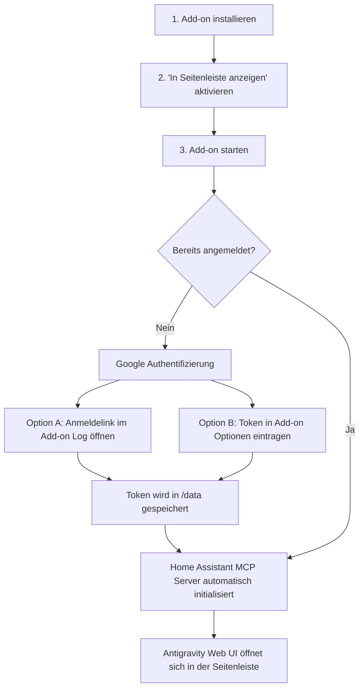

# 🌌 Home Assistant Add-on: Google Antigravity & MCP Assistant

[](https://my.home-assistant.io/redirect/supervisor_add_addon_repository/?repository_url=https%3A%2F%2Fgithub.com%2Fdinkelhause%2Fhomeassistant-antigravity)


Dieses Repository stellt ein vollständiges Home Assistant Add-on für **Google Antigravity** bereit. Es lädt automatisch die aktuellste Version der Antigravity-Plattform herunter, startet den Remote-Control-Server und bettet das vollständige Webinterface per **Home Assistant Ingress** direkt in deine Seitenleiste ein – **ohne externe Portfreigaben**.

Zusätzlich konfiguriert das Add-on automatisch den **Home Assistant MCP Server (Model Context Protocol)**, sodass Antigravity sofort deine Entitäten steuern, Automationen analysieren und Konfigurationsdateien unter `/config` bearbeiten kann.

---

## ✨ Features

- 🚀 **Automatischer Download & Updates**: Lädt beim Start automatisch das neueste offizielle Release von Google herunter (inklusive SHA512-Prüfung). Unterstützt **`amd64` (x86_64)** und **`aarch64` (Raspberry Pi 4/5, HA Green/Yellow)**.
- 🌐 **Nahtlose Ingress-Integration**: Direkt in die Home Assistant Seitenleiste integriert über einen internen Nginx-Proxy mit WebSocket-Unterstützung und dynamischem Pfad-Rewriting.
- 🔌 **Home Assistant MCP Server Integration**:
  - **Zero-Config Auto-Modus**: Nutzt direkt die Home Assistant Supervisor API (`http://supervisor/core/api/mcp`) und den Supervisor-Token.
  - **Manueller Modus**: Option für benutzerdefinierte URLs und Long-Lived Access Tokens (LLAT).
  - **History-Endpunkt**: Optionale Einbindung von `hass_mcp` für Statistiken und Verläufe.
- 🧙‍♂️ **Geführtes Onboarding**: Visuelle Onboarding-Seite im Ingress-Interface und klare Ausgabe der Google-Anmelde-URL in den Add-on Logs.
- 💾 **Dauerhafte Persistenz**: Tokens, Arbeitsbereiche (`/data/workspace`), Konversationen und MCP-Konfigurationen bleiben im persistenten `/data`-Volume dauerhaft erhalten.
- 🛠️ **Direkter Zugriff auf HA-Dateien**: `/config` (Automatisierungen, Scripts, `configuration.yaml`, Dashboards), `/share` und `/addons` sind direkt im Container eingehängt.

---

## 📦 Installation

### Option 1: 1-Klick-Installation (Empfohlen)

Klicke auf den folgenden Button, um das Repository direkt zu deinem Home Assistant hinzuzufügen:

[](https://my.home-assistant.io/redirect/supervisor_add_addon_repository/?repository_url=https%3A%2F%2Fgithub.com%2Fdinkelhause%2Fhomeassistant-antigravity)

### Option 2: Manuell hinzufügen

1. Gehe in Home Assistant zu **Einstellungen** -> **Add-ons** -> **Add-on Store**.
2. Klicke oben rechts auf das Drei-Punkte-Menü (⋮) und wähle **Repositories**.
3. Füge folgende Repository-URL ein:
   ```text
   https://github.com/dinkelhause/homeassistant-antigravity
   ```
4. Klicke auf **Hinzufügen** und schließe den Dialog.
5. Das Add-on **Antigravity** erscheint nun im Add-on Store. Klicke darauf und wähle **Installieren**.

---

## 🎯 Onboarding & Ersteinrichtung



### Schritt 1: Starten & Ingress aktivieren
Aktiviere in den Add-on Einstellungen den Schalter **In der Seitenleiste anzeigen** und starte das Add-on.

### Schritt 2: Google Antigravity Authentifizierung
- **Über das Log**: Öffne den Reiter **Protokoll** des Add-ons. Kopiere den dort generierten Google-Login-Link, öffne ihn in deinem Browser und bestätige die Berechtigung.
- **Alternativ über Optionen**: Falls du bereits ein OAuth-Token hast, trage es in den Add-on Optionen im Feld `auth_token` ein.

### Schritt 3: Home Assistant MCP Server nutzen
Das Add-on konfiguriert den MCP-Server automatisch. Sobald du das Webinterface in der Seitenleiste öffnest, stehen dir unter anderem folgende Tools zur Verfügung:
- `homeassistant__GetLiveContext`
- `intent__HassTurnOn` / `intent__HassTurnOff`
- `climate__HassClimateSetTemperature`
- `vacuum__HassVacuumStart`
- Und viele weitere Steuerungs- und Analysebefehle!

---

## ⚙️ Konfiguration

Die Einstellungen können direkt im Add-on Reiter **Konfiguration** angepasst werden:

```yaml
auto_update: true
remote_control_name: "homeassistant-antigravity"
ha_mcp_enabled: true
ha_mcp_mode: "auto"
ha_mcp_url: "auto"
ha_mcp_token: ""
ha_mcp_history_enabled: false
ha_mcp_history_url: "auto"
auth_token: ""
log_level: "info"
```

### Konfigurationsoptionen im Detail:

| Schlüssel | Typ | Standard | Beschreibung |
|---|---|---|---|
| `auto_update` | bool | `true` | Sucht bei jedem Start nach neueren Versionen im Google Release Manifest und aktualisiert die CLI automatisch. |
| `remote_control_name` | str | `"homeassistant-antigravity"` | Instanzname im Antigravity-Netzwerk. |
| `ha_mcp_enabled` | bool | `true` | Aktiviert die automatische Einbindung des Home Assistant MCP Servers in Antigravity. |
| `ha_mcp_mode` | str | `"auto"` | `auto`: Nutzt den internen Supervisor-Token.<br>`manual`: Nutzt benutzerdefinierte URL und Token. |
| `ha_mcp_url` | str | `"auto"` | MCP-Endpunkt (bei `auto`: `http://supervisor/core/api/mcp`). |
| `ha_mcp_token` | password | `""` | Optionaler Long-Lived Access Token für den manuellen Modus. |
| `ha_mcp_history_enabled` | bool | `false` | Aktiviert den Verlauf- und Statistik-MCP-Server (`hass_mcp`). |
| `auth_token` | password | `""` | Optionales Google OAuth Token zur direkten Authentifizierung. |
| `log_level` | str | `"info"` | Protokollierungsdetail: `trace`, `debug`, `info`, `warning`, `error`. |

---

## 🏗️ Architektur

```
┌────────────────────────────────────────────────────────┐
│ Home Assistant Core & Frontend                         │
│  ├─ Sidebar Ingress Link: /api/hassio_ingress/<token>  │
│  └─ Supervisor API Endpoint: http://supervisor/core    │
└──────────────────────────┬─────────────────────────────┘
                           │ Ingress Port 8099
┌──────────────────────────▼─────────────────────────────┐
│ Antigravity Add-on Container                           │
│                                                        │
│  ┌──────────────────────────────────────────────────┐  │
│  │ Nginx Reverse Proxy (Port 8099)                  │  │
│  │  - X-Ingress-Path base rewriting (<base href>)   │  │
│  │  - WebSocket streaming (Upgrade / Connection)    │  │
│  │  - Onboarding fallback UI                        │  │
│  └──────────────────────┬───────────────────────────┘  │
│                         │ localhost:4400               │
│  ┌──────────────────────▼───────────────────────────┐  │
│  │ Antigravity Server (agy --remote-control)        │  │
│  │  - React / Vite Web Interface                    │  │
│  │  - Autonomous Agent Core                         │  │
│  │  - Model Context Protocol Client (MCP)           │  │
│  └──────────┬───────────────────────────┬───────────┘  │
│             │                           │              │
│             ▼                           ▼              │
│  ┌──────────────────────┐  ┌────────────────────────┐  │
│  │ Persistent Storage   │  │ Home Assistant Storage │  │
│  │ (/data/.gemini)      │  │ (/config, /share)      │  │
│  │  - mcp_config.json   │  │  - configuration.yaml  │  │
│  │  - OAuth tokens      │  │  - automations.yaml    │  │
│  │  - workspace files   │  │  - blueprints, scripts │  │
│  └──────────────────────┘  └────────────────────────┘  │
└────────────────────────────────────────────────────────┘
```

---

## 🛡️ Lizenz & Rechtliche Hinweise

Dieses Projekt ist unter der **MIT-Lizenz** lizenziert – siehe [LICENSE](LICENSE) für Details.

### Drittanbieter-Software & Markenhinweis
- Dieses Repository enthält ausschließlich quelloffene Wrapper-Skripte, Containerdefinitionen und Integrationscode für Home Assistant.
- Die eigentliche **Google Antigravity Software** (`agy`) wird **nicht** in diesem Repository gehostet oder weiterverbreitet. Sie wird zur Laufzeit vom Endanwender direkt von den offiziellen Google-Servern heruntergeladen und unterliegt den jeweiligen Google Nutzungsbedingungen (Terms of Service).
- *Google* und *Antigravity* sind Marken der Google LLC. Dieses Projekt ist eine unabhängige Community-Entwicklung und steht in keiner geschäftlichen Verbindung zu Google LLC.

- **Fragen oder Feature-Wünsche?** Erstelle gerne ein Issue im [GitHub Repository](https://github.com/dinkelhause/homeassistant-antigravity/issues).
