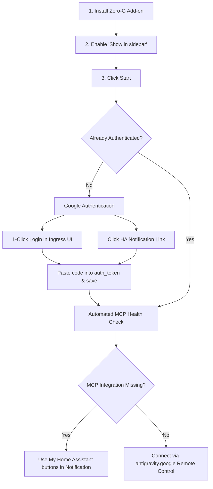

# 🛸 Zero-G: Autonomous AI Assistant & MCP Orchestrator for Home Assistant

[🇬🇧 English](README.md) | [🇩🇪 Deutsch](README.de.md)

[](https://my.home-assistant.io/redirect/supervisor_add_addon_repository/?repository_url=https%3A%2F%2Fgithub.com%2Fseppelw%2Fzero-g)
[](https://github.com/seppelw/zero-g)
[](https://github.com/seppelw/zero-g)
[](https://github.com/seppelw/zero-g)
[](LICENSE)

> **Zero-G** seamlessly integrates **Google Antigravity** — Google's cutting-edge autonomous AI coding and execution platform — directly into Home Assistant. With native Ingress integration, intuitive onboarding, and automated **Dual Model Context Protocol (MCP)** server discovery, Zero-G turns your smart home into an intelligent, AI-driven automation hub without any port forwarding.

---

## 🚀 Key Features

- 🌐 **Seamless Home Assistant Ingress**: Access the Zero-G status dashboard directly from your Home Assistant sidebar without opening external ports.
- 🔌 **Automated Dual MCP Server Orchestration**:
  - **Core MCP Server (`mcp_server`, `/api/mcp`)**: Real-time entity control via Home Assistant's native Assist pipeline (lights, switches, climate, vacuums, scripts, and scenes).
  - **Community MCP Server ([`czechbol/hass-mcp`](https://github.com/czechbol/hass-mcp), `/api/hass_mcp`)**: Deep management tools for Lovelace dashboards, YAML configuration files, HACS packages, and backups.
  - **Smart Live Probe**: Zero-G probes both endpoints on boot. If any integration is missing, it creates a persistent notification with **My Home Assistant 1-click setup buttons**.
  - **Auto-Dual-Mounting**: When community MCP is detected, it is mounted alongside Core MCP automatically without manual configuration.
- 🔄 **Self-Updating Engine**: Automatically checks for new Google Antigravity releases on startup and updates the CLI binary securely (verified via SHA-512). Supports **`amd64` (x86_64)** and **`aarch64` (Raspberry Pi 4/5, Home Assistant Green & Yellow)**.
- 🔐 **Frictionless Google OAuth**: Single-click Google login directly from the Ingress interface or Home Assistant notification drawer, with persistent PKCE state across restarts.
- 📁 **Direct Access to HA Storage**: Direct read/write access to `/config` (`configuration.yaml`, automations, blueprints), `/share`, and `/addons`.
- 💾 **State Persistence**: Tokens, workspaces (`/data/workspace`), conversation state, and custom tool definitions remain safely preserved in persistent storage across updates.

---

## 💻 Hardware Requirements (Important for Proxmox & VM Users)

Zero-G runs the official Google Antigravity binary, which requires modern CPU instructions (**PCLMULQDQ / PCLMUL**):

- **Bare-Metal Hardware**: Supported on virtually all CPUs from ~2011 onwards (Intel Westmere / AMD Bulldozer and newer), as well as 64-bit ARM (Raspberry Pi 4/5).
- **Virtual Machines (Proxmox VE, ESXi, UNRAID, VirtualBox)**: ⚠️ If your Home Assistant OS runs in a virtual machine, default virtualized CPU types (like `kvm64` or `qemu64`) hide modern CPU instruction flags!
  - **Fix**: In your hypervisor (e.g. Proxmox), open your HA VM settings and change the **CPU Type** to **`host`**. Then perform a complete shutdown and restart of the VM.

---

## 📦 Installation

### Option 1: 1-Click Installation (Recommended)

Click the badge below to add the repository directly to your Home Assistant instance:

[](https://my.home-assistant.io/redirect/supervisor_add_addon_repository/?repository_url=https%3A%2F%2Fgithub.com%2Fseppelw%2Fzero-g)

### Option 2: Manual Installation

1. In Home Assistant, navigate to **Settings** → **Add-ons** → **Add-on Store**.
2. Click the three-dots menu (⋮) in the top-right corner and select **Repositories**.
3. Add the following repository URL:
   ```text
   https://github.com/seppelw/zero-g
   ```
4. Click **Add** and close the modal.
5. Select **Zero-G** from the Add-on Store list and click **Install**.

---

## 🎯 Onboarding & Quickstart



### Steps:

1. Click **Start** on the Add-on page and enable **Show in sidebar**.
2. Open the **Zero-G** dashboard from the sidebar.
3. Click **🔗 Sign in with Google**, approve permissions, and copy your authorization code.
4. Click **⚙️ Add-on Configuration**, paste the code into `auth_token`, and click **Save & Restart**.
5. Once connected, open [https://antigravity.google/](https://antigravity.google/) and connect to your remote instance (default: `homeassistant-zero-g`).

---

## 🔌 Model Context Protocol (MCP) Setup

Zero-G automatically configures MCP so your AI assistant can interact with your smart home:

| Integration | Purpose | How to Add |
|---|---|---|
| **Core MCP Server** (`mcp_server`) | Control lights, climate, switches, covers, scripts, and Assist intents | [](https://my.home-assistant.io/redirect/config_flow_start/?domain=mcp_server) |
| **Community MCP Server** ([`czechbol/hass-mcp`](https://github.com/czechbol/hass-mcp)) | Full system tools: edit Lovelace dashboards, manage YAML files, audit configurations | [](https://my.home-assistant.io/redirect/hacs_repository/?owner=czechbol&repository=hass-mcp&category=integration) |

---

## ⚙️ Configuration Options

Configure Zero-G directly in the Home Assistant Add-on **Configuration** tab:

```yaml
auto_update: true
remote_control_name: "homeassistant-zero-g"
ha_mcp_enabled: true
ha_mcp_mode: "auto"
ha_mcp_url: ""
ha_mcp_token: ""
ha_mcp_history_enabled: false
ha_mcp_history_url: ""
auth_token: ""
log_level: "info"
```

| Option | Type | Default | Description |
|---|---|---|---|
| `auto_update` | bool | `true` | Checks for and downloads the latest official Google Antigravity release on startup. |
| `remote_control_name` | str | `"homeassistant-zero-g"` | Custom instance name displayed on `antigravity.google`. |
| `ha_mcp_enabled` | bool | `true` | Enables automated Model Context Protocol orchestration. |
| `ha_mcp_mode` | str | `"auto"` | `auto`: Uses internal Supervisor token.<br>`manual`: Uses custom endpoint and LLAT token. |
| `ha_mcp_url` | url? | `""` | Custom Core MCP endpoint (default: `http://supervisor/core/api/mcp`). |
| `ha_mcp_token` | password | `""` | Long-Lived Access Token for manual mode. |
| `ha_mcp_history_enabled` | bool | `false` | Enables community MCP server (`czechbol/hass-mcp`). |
| `ha_mcp_history_url` | url? | `""` | Custom Community MCP endpoint (default: `http://supervisor/core/api/hass_mcp`). |
| `auth_token` | password | `""` | Google OAuth Authorization Code or raw token. |
| `log_level` | str | `"info"` | Logging verbosity (`trace`, `debug`, `info`, `warning`, `error`). |

---

## 🏗️ Architecture

```
┌────────────────────────────────────────────────────────┐
│ Home Assistant Core & Supervisor                       │
│  ├─ Sidebar Ingress Link: /api/hassio_ingress/<token>  │
│  ├─ Core MCP API: http://supervisor/core/api/mcp       │
│  └─ Community MCP API: http://supervisor/core/api/hass_mcp │
└──────────────────────────┬─────────────────────────────┘
                           │ Port 8099 (Ingress)
┌──────────────────────────▼─────────────────────────────┐
│ Zero-G Add-on Container                                │
│                                                        │
│  ┌──────────────────────────────────────────────────┐  │
│  │ Nginx Reverse Proxy (Port 8099)                  │  │
│  │  - Ingress WebSocket & Path Rewriting            │  │
│  │  - Dynamic /auth_info.json & /mcp_info.json APIs │  │
│  │  - Multilingual Onboarding UI (EN/DE)            │  │
│  └──────────────────────┬───────────────────────────┘  │
│                         │ localhost:4400               │
│  ┌──────────────────────▼───────────────────────────┐  │
│  │ Antigravity Engine (agy --remote-control)        │  │
│  │  - Autonomous AI Coding Agent                    │  │
│  │  - Dual MCP Client (Core + Community)            │  │
│  └──────────┬───────────────────────────┬───────────┘  │
│             │                           │              │
│             ▼                           ▼              │
│  ┌──────────────────────┐  ┌────────────────────────┐  │
│  │ Persistent Storage   │  │ Home Assistant Storage │  │
│  │ (/data/.gemini)      │  │ (/config, /share)      │  │
│  │  - mcp_config.json   │  │  - configuration.yaml  │  │
│  │  - OAuth session     │  │  - automations.yaml    │  │
│  │  - workspace files   │  │  - lovelace dashboards │  │
│  └──────────────────────┘  └────────────────────────┘  │
└────────────────────────────────────────────────────────┘
```

---

## 🛡️ License & Legal Notices

This project is licensed under the **MIT License** — see [LICENSE](LICENSE) for details.

### Third-Party Software & Trademark Notice
- This repository contains open-source container wrapper scripts, configuration schemas, and Home Assistant integration logic.
- The **Google Antigravity** binary (`agy`) is **not** hosted or redistributed by this repository. It is downloaded by the end user directly from official Google servers at runtime and is subject to Google's Terms of Service.
- *Google* and *Antigravity* are trademarks of Google LLC. This project is an independent community add-on and is not affiliated with, sponsored by, or endorsed by Google LLC.
